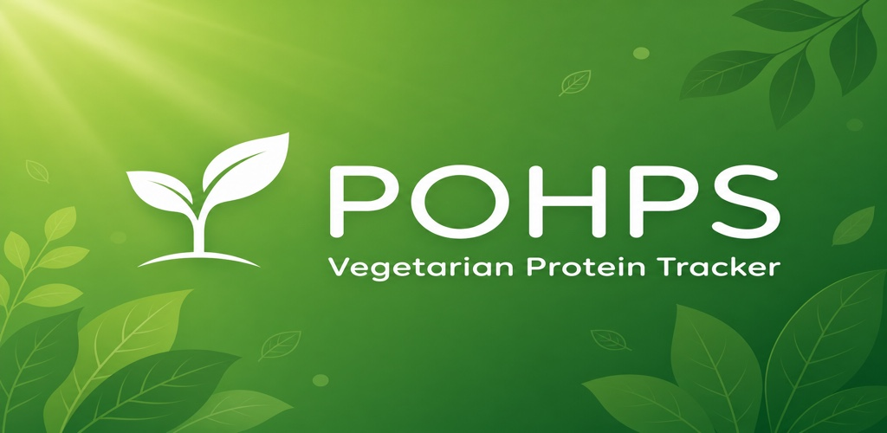

# POHPS: Vegetarian Protein



POHPS is a nutrient tracker for vegetarians and vegans, built with Flutter. It helps you reach a daily protein goal and keep an eye on the nutrients plant-based diets can run short on: iron, calcium, vitamin B12 and water.

No ads, no subscriptions, no accounts, and no data collection. Everything stays on your device.

## Features

- **Daily protein goal.** Set the target your dietitian recommends and watch a progress ring fill up as you log.
- **About 100 built-in foods.** Everyday vegetarian staples with protein per serving, grouped into categories such as legumes, grains, vegetables, dairy and eggs, nuts and seeds, and beverages.
- **Diet types.** Lacto-Ovo, Vegan, Allium Vegetarian and Allium Vegan. Vegan options hide eggs and dairy. Allium options add onions, garlic, leeks and similar foods.
- **Optional trackers.** Turn on what you need in Settings:
  - Water: daily intake against a goal
  - Iron: from the foods you log
  - Calcium: from the foods you log, with tips for dairy-free sources
  - Vitamin B12: a simple daily check-off
- **One-tap logging.** Swipe the date to look back at previous days.
- **Custom foods and recipes.** Create your own foods, or build recipes from ingredients.
- **Food mood.** Optionally rate how you liked each food.
- **Statistics.** Protein trend graphs, a goal-met calendar and Excel export.
- **Achievements.** Badges for milestones and streaks, up to 30 days in a row.
- **Backup and restore.** Save your data to a file and restore it later.
- **Metric or imperial units.**
- **Accessible UI.** Large text, big tap targets, high contrast, and light and dark mode.
- **Languages.** English, Traditional Chinese and Simplified Chinese.

## Getting started

The Flutter project lives in the `pohps/` directory.

```bash
cd pohps
flutter pub get
flutter run
```

Run the tests with:

```bash
flutter test
```

## Project structure

| Path | Contents |
|---|---|
| `pohps/lib/screens/` | App screens (dashboard, add food, statistics, settings, …) |
| `pohps/lib/widgets/` | Progress rings, charts, dialogs and other UI pieces |
| `pohps/lib/services/` | Backup, statistics, Excel export and donations |
| `pohps/lib/food_data.dart` | Built-in food database |
| `pohps/lib/data/patch_notes.dart` | "What's New" notes shown after an update |
| `pohps/lib/l10n/` | English, Traditional Chinese and Simplified Chinese strings |
| `pohps/docs/` | Support page, store listing assets and Play Console notes |

## Privacy

POHPS stores all data locally on your device. There are no accounts, no analytics and no data collection. See the [privacy policy](https://logicphile.com/pohps/).

## Supporting the project

POHPS has no paywalls. Every feature is available to everyone. You can make an optional donation from the bottom of Settings, and after some important updates. Donations never unlock anything.

## Disclaimer

POHPS is not a substitute for professional medical or dietary advice. Nutrient values are approximate per standard serving. Always talk to your doctor or registered dietitian before changing your diet.

## Contact

- Support: https://logicphile.com/pohps/
- Email: allan@logicphile.com
- Bugs and feature requests: [GitHub Issues](https://github.com/allanjchiang/pohps/issues)
